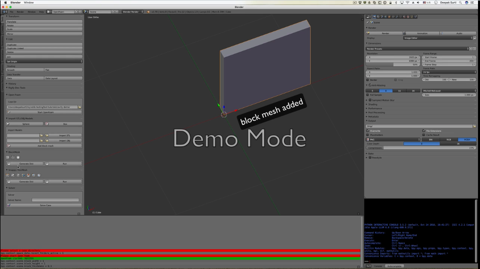
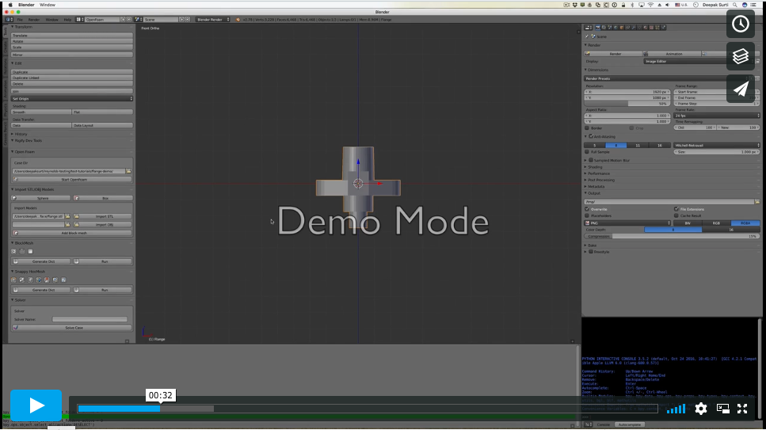

Reynolds+Blender
================

**Reynolds-Blender** is a reference implementation to demonstrate the
integration of pre-processing components from
[Reynolds](https://github.com/dmsurti/reynolds) to build a GUI for the
pre-processing steps of [OpenFoam](http://openfoam.com).

This reference implemenation uses Blender and is based on the following
constraint:

1. Write Blender add-ons with standalone operators that invoke the Reynolds
   API.

Demos
---

BlockMeshDict Addon Interface
---

